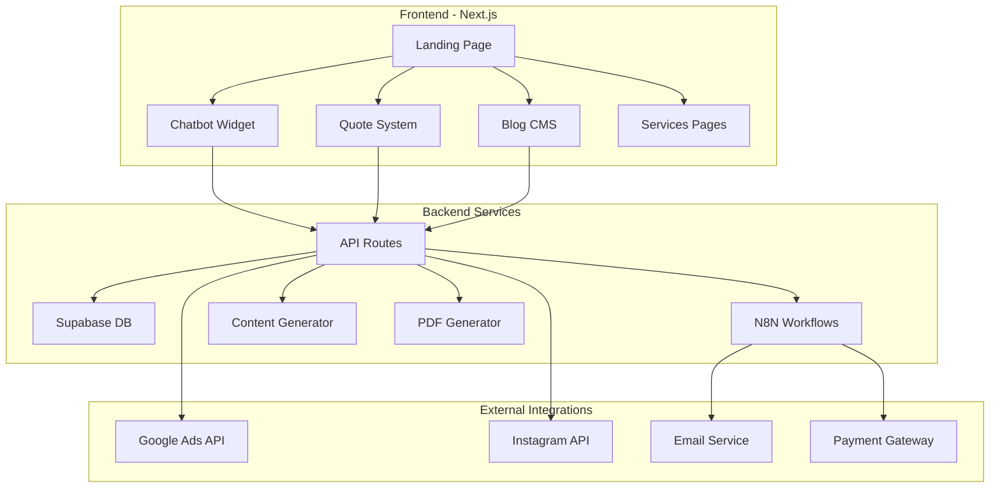

# Design Document - WilkieDevs Enhancement

## Overview

Este diseño transforma WilkieDevs.com en una plataforma automatizada y autosostenible que combina servicios de auditoría, desarrollo web y automatización. El sistema mantiene la estética actual mientras incorpora funcionalidades avanzadas de IA, automatización y monetización.

### Arquitectura General



## Architecture

### Frontend Architecture (Next.js 15 + TypeScript)

**Estructura de Componentes:**
- **Layout System**: Header, Footer, Navigation responsiva
- **Page Components**: Home, Services, Blog, Contact, Quote
- **Widget Components**: Chatbot, Quote Calculator, Content Cards
- **Form Components**: Contact forms, Quote forms con validación
- **SEO Components**: Meta tags dinámicos, structured data

**Estado y Datos:**
- **React Context**: Para estado global del chatbot y usuario
- **SWR/React Query**: Para cache y sincronización de datos
- **Form State**: React Hook Form para formularios complejos

### Backend Architecture

**API Routes Structure:**
```
/api
├── /leads          # Gestión de leads
├── /quotes         # Sistema de cotizaciones
├── /content        # Gestión de contenido
├── /webhooks       # Webhooks para N8N
├── /chatbot        # API del chatbot
└── /analytics      # Métricas y analytics
```

**Database Schema (Supabase):**
- **wilkiedevs_leads**: Captura y gestión de leads
- **wilkiedevs_quotes**: Cotizaciones y propuestas
- **wilkiedevs_sales**: Ventas y facturación
- **wilkiedevs_content**: Contenido automatizado
- **wilkiedevs_logs**: Logging y auditoría

## Components and Interfaces

### 1. Chatbot System

**Componente Principal:**
```typescript
interface ChatbotProps {
  isOpen: boolean;
  onToggle: () => void;
  initialMessage?: string;
}

interface ChatMessage {
  id: string;
  type: 'user' | 'bot';
  content: string;
  timestamp: Date;
  actions?: ChatAction[];
}

interface ChatAction {
  type: 'quote' | 'contact' | 'service';
  label: string;
  data: any;
}
```

**Funcionalidades:**
- Procesamiento de lenguaje natural básico
- Integración con base de conocimientos del sitio
- Escalación a formulario de contacto
- Captura automática de leads

### 2. Quote System

**Tipos de Cotización:**
```typescript
interface QuoteRequest {
  projectType: 'wordpress' | 'loveable' | 'custom' | 'automation';
  requirements: string;
  budget?: string;
  timeline?: string;
  contactInfo: ContactInfo;
}

interface QuoteCalculation {
  basePrice: number;
  features: QuoteFeature[];
  totalPrice: number;
  estimatedTime: string;
}
```

**Generador de PDF:**
- Template personalizado con branding WilkieDevs
- Desglose detallado de servicios
- Términos y condiciones
- Call-to-action para aceptación

### 3. Content Management System

**Blog Engine:**
```typescript
interface BlogPost {
  id: string;
  title: string;
  slug: string;
  content: string;
  excerpt: string;
  seoTitle: string;
  seoDescription: string;
  tags: string[];
  publishedAt?: Date;
  status: 'draft' | 'published';
}
```

**Content Generator:**
- Templates para diferentes tipos de contenido
- Integración con IA para generación automática
- Programación de publicaciones
- Optimización SEO automática

### 4. Automation Services

**N8N Integration:**
```typescript
interface AutomationWorkflow {
  id: string;
  name: string;
  description: string;
  category: string;
  estimatedROI: string;
  complexity: 'basic' | 'intermediate' | 'advanced';
}

interface WorkflowExecution {
  workflowId: string;
  triggerData: any;
  status: 'pending' | 'running' | 'completed' | 'failed';
}
```

## Data Models

### Lead Management
```sql
CREATE TABLE wilkiedevs_leads (
  id UUID PRIMARY KEY DEFAULT gen_random_uuid(),
  name VARCHAR(255) NOT NULL,
  email VARCHAR(255) NOT NULL UNIQUE,
  phone VARCHAR(50),
  company VARCHAR(255),
  service_interest TEXT,
  source VARCHAR(100), -- 'website', 'chatbot', 'social', etc.
  utm_source VARCHAR(100),
  utm_medium VARCHAR(100),
  utm_campaign VARCHAR(100),
  status VARCHAR(50) DEFAULT 'new',
  score INTEGER DEFAULT 0, -- Lead scoring
  notes TEXT,
  created_at TIMESTAMP WITH TIME ZONE DEFAULT NOW(),
  updated_at TIMESTAMP WITH TIME ZONE DEFAULT NOW()
);
```

### Quote System
```sql
CREATE TABLE wilkiedevs_quotes (
  id UUID PRIMARY KEY DEFAULT gen_random_uuid(),
  lead_id UUID REFERENCES wilkiedevs_leads(id),
  project_type VARCHAR(100) NOT NULL,
  requirements TEXT NOT NULL,
  features JSONB, -- Array of selected features
  base_price DECIMAL(10,2),
  total_price DECIMAL(10,2),
  estimated_hours INTEGER,
  pdf_url TEXT,
  status VARCHAR(50) DEFAULT 'draft',
  valid_until DATE,
  created_at TIMESTAMP WITH TIME ZONE DEFAULT NOW(),
  updated_at TIMESTAMP WITH TIME ZONE DEFAULT NOW()
);
```

### Content Management
```sql
CREATE TABLE wilkiedevs_content (
  id UUID PRIMARY KEY DEFAULT gen_random_uuid(),
  type VARCHAR(50) NOT NULL, -- 'blog', 'instagram', 'twitter'
  title VARCHAR(500),
  content TEXT NOT NULL,
  excerpt TEXT,
  seo_title VARCHAR(255),
  seo_description TEXT,
  tags TEXT[],
  platform VARCHAR(50),
  scheduled_date TIMESTAMP WITH TIME ZONE,
  published_date TIMESTAMP WITH TIME ZONE,
  status VARCHAR(50) DEFAULT 'draft',
  performance_metrics JSONB, -- Views, clicks, engagement
  created_at TIMESTAMP WITH TIME ZONE DEFAULT NOW()
);
```

## Error Handling

### Frontend Error Boundaries
```typescript
interface ErrorBoundaryState {
  hasError: boolean;
  error?: Error;
  errorInfo?: ErrorInfo;
}

class GlobalErrorBoundary extends Component<Props, ErrorBoundaryState> {
  // Captura errores de React y los reporta
  // Muestra UI de fallback amigable
  // Integra con sistema de logging
}
```

### API Error Handling
```typescript
interface APIError {
  code: string;
  message: string;
  details?: any;
  timestamp: Date;
}

class ErrorHandler {
  static handle(error: Error, context: string): APIError;
  static log(error: APIError): void;
  static notify(error: APIError): void; // Via N8N
}
```

### Database Error Recovery
- Retry logic para operaciones fallidas
- Fallback a cache local cuando sea posible
- Notificaciones automáticas de errores críticos
- Backup automático de datos importantes

## Testing Strategy

### Unit Testing
- **Components**: Testing Library + Jest
- **API Routes**: Supertest + Jest
- **Utilities**: Jest para funciones puras
- **Database**: Supabase test environment

### Integration Testing
- **API Endpoints**: End-to-end con datos reales
- **N8N Workflows**: Testing de webhooks
- **Payment Flow**: Sandbox environments
- **Email Delivery**: Test providers

### E2E Testing
- **User Journeys**: Playwright para flujos completos
- **Quote Generation**: Desde formulario hasta PDF
- **Lead Capture**: Chatbot → Database → N8N
- **Content Publishing**: CMS → Blog → SEO

### Performance Testing
- **Core Web Vitals**: Lighthouse CI
- **API Response Times**: Load testing
- **Database Queries**: Query optimization
- **CDN Performance**: Asset delivery testing

## SEO and Performance Optimization

### Technical SEO
```typescript
interface SEOConfig {
  title: string;
  description: string;
  keywords: string[];
  openGraph: OpenGraphData;
  structuredData: StructuredData;
  canonicalUrl: string;
}
```

**Implementación:**
- Meta tags dinámicos por página
- Structured data para servicios y artículos
- Sitemap XML automático
- Robots.txt optimizado
- Schema markup para empresa local

### Performance Optimization
- **Image Optimization**: Next.js Image component + WebP
- **Code Splitting**: Dynamic imports por ruta
- **Caching Strategy**: ISR + SWR para datos dinámicos
- **CDN**: Vercel Edge Network
- **Bundle Analysis**: Webpack Bundle Analyzer

### Core Web Vitals Targets
- **LCP**: < 2.5s (Hero images optimizadas)
- **FID**: < 100ms (Code splitting + lazy loading)
- **CLS**: < 0.1 (Dimensiones fijas para elementos)

## Security Considerations

### Data Protection
- **GDPR Compliance**: Consentimiento explícito para cookies
- **Data Encryption**: HTTPS + database encryption
- **API Security**: Rate limiting + authentication
- **Input Validation**: Sanitización en frontend y backend

### Authentication & Authorization
```typescript
interface SecurityConfig {
  apiKeys: {
    supabase: string;
    n8n: string;
    openai: string;
  };
  rateLimit: {
    windowMs: number;
    max: number;
  };
  cors: {
    origin: string[];
    credentials: boolean;
  };
}
```

## Deployment Architecture

### Hosting Strategy
- **Frontend**: Vercel (Next.js optimizado)
- **Database**: Supabase (PostgreSQL managed)
- **Automation**: N8N en VPS Hostinger
- **Assets**: Vercel CDN + Cloudinary para imágenes

### CI/CD Pipeline
```yaml
# GitHub Actions workflow
name: Deploy WilkieDevs
on:
  push:
    branches: [main]
jobs:
  deploy:
    - Build and test
    - Deploy to Vercel
    - Run database migrations
    - Update N8N workflows
    - Notify deployment status
```

### Environment Configuration
- **Development**: Local + Supabase dev
- **Staging**: Vercel preview + Supabase staging
- **Production**: Vercel + Supabase production

## Monitoring and Analytics

### Application Monitoring
- **Error Tracking**: Sentry integration
- **Performance**: Vercel Analytics + Core Web Vitals
- **Uptime**: Pingdom + status page
- **Database**: Supabase built-in monitoring

### Business Analytics
- **Google Analytics 4**: Enhanced ecommerce tracking
- **Conversion Tracking**: Lead capture → Quote → Sale
- **A/B Testing**: Vercel Edge Config para experiments
- **Custom Dashboards**: Supabase + Chart.js

### Key Metrics
- **Lead Generation**: Conversion rate por fuente
- **Quote Conversion**: Quote → Sale rate
- **Content Performance**: Blog traffic → Lead conversion
- **Automation ROI**: N8N workflow effectiveness